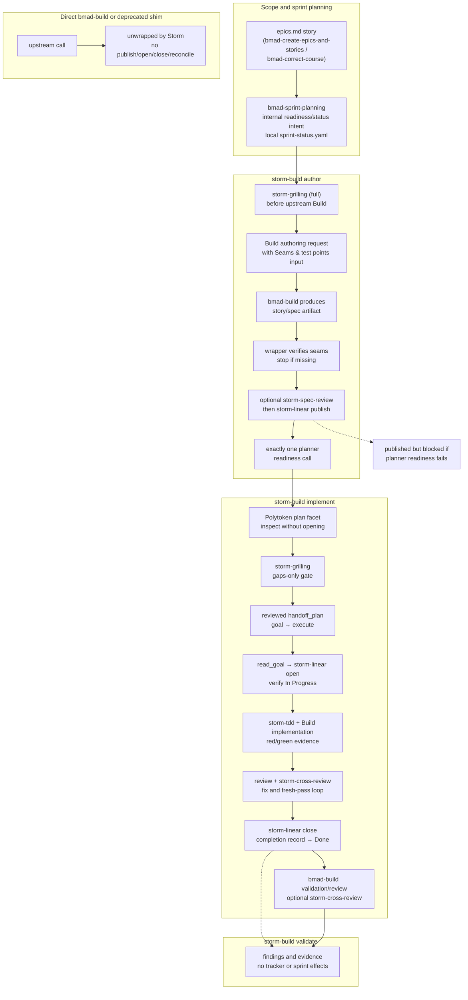

# The BMAD v7 Build and Storm Wrapper Flow

Upstream `bmad-build` is canonical for current BMAD work. Its authoring,
implementation, and validation/review routes remain upstream-owned. The
upstream activation runs before its own route selection, exposes no stable
selected-route metadata, and reaches `on_complete` only after workflow work has
finished. Storm therefore cannot safely attach its phase lifecycle to direct
Build callbacks.

`bmad-create-story`, `bmad-dev-story`, and `bmad-quick-dev` are upstream
deprecation shims. They warn and forward their original input directly to
`bmad-build`. Direct Build and shim calls are intentionally **unwrapped** by
Storm: they do not automatically publish, open, or close Linear work and do not
reconcile sprint status.

When those lifecycle effects are wanted, use the explicit Storm wrapper:

```text
storm-build author <story-key>
storm-build implement <story-key-or-issue>
storm-build validate <scope>
```

The wrapper owns the explicit route and invokes the upstream Build work inside a
safe pre/post boundary. It is not a replacement for upstream Build; it is the
Storm-managed lifecycle around it.

## The flow at a glance



## Scope and sprint-planning ownership

BMAD planning owns scope: `bmad-create-epics-and-stories` decomposes work and
`bmad-correct-course` handles changes, including newly discovered bugs. Intake
can record unsolicited work as a project-less `needs-triage` issue, but it does
not make that issue ready for implementation.

`bmad-sprint-planning` is the single native owner of readiness, the sprint status
view, validation, repair, and every local `sprint-status.yaml` projection. Status
and implementation readiness are **internal planning intents**, not separate
active Storm workflows:

- a request such as “what's the status” uses the status intent inside
  `bmad-sprint-planning`;
- retired `bmad-sprint-status` and `check-implementation-readiness` compatibility
  calls forward to the corresponding planner intent; and
- `storm-status` may project native `/jobs` and `/todo` operational state, but it
  is not the sprint-status owner.

Planning is deterministic. If deterministic inputs are unavailable, inference
is a warning-only fallback, and the warning identifies that inference was used.
Legacy `sprint-plan`/status compatibility is preserved; Storm does not invent a
replacement output schema.

Headless use follows the installed planner's documented native headless intent
and JSON interface. Use the installed skill's documentation/help to determine
the actual invocation. Use `--autonomous` only when that installed planner
explicitly advertises the flag; Storm does not claim that the current script
universally accepts it. If it is not advertised, use the native headless intent,
including natural language such as “run sprint planning headless.”

The phase authority remains straightforward: before publication, BMAD planning
artifacts (`epics.md`, the story file, and `sprint-status.yaml`) win; after
publication, the Linear issue carrying the published specification owns
implementation state. If the phase cannot be determined, stop and ask rather
than overwrite.

## Why `storm-build` owns the lifecycle

Storm cannot use direct `bmad-build` customization as a reliable phase hook:

1. Build customization activation occurs before Build selects authoring,
   implementation, or validation/review.
2. The selected route is not exposed as stable metadata that a Storm hook can
   safely capture.
3. `on_complete` is post-workflow and cannot provide the required pre-work
   authoring grill or route-specific lifecycle boundary.

`storm-build` receives an explicit subcommand and target first, performs the
Storm pre-work, invokes upstream Build, and owns only the matching post-work.
It does not infer a route from mutable sprint or Linear state. An invalid or
ambiguous wrapper subcommand fails closed with no Storm tracker side effect.

## Authoring: `storm-build author <story-key>`

The author wrapper preserves the grilled authoring flow while making its
boundary explicit:

1. **Capture the target and route.** The wrapper fixes `author` and the story key
   before doing any Storm or Build work.
2. **Grill before Build.** `storm-grilling` runs in `full` mode: one question at
   a time, shared understanding, glossary/ADR capture, and a deliberate
   kick-back when the story is too large or unclear. It captures
   `Seams & test points` as explicit input to the Build authoring request.
3. **Run upstream Build.** Pass the captured seam list in the authoring request;
   `bmad-build` then produces the story/spec artifact with tasks, acceptance
   criteria, and development notes.
4. **Verify the artifact.** The wrapper verifies that the completed artifact
   carries the captured `Seams & test points`. If they are missing, stop without
   spec review or publication.
5. **Review and publish.** Offer optional `storm-spec-review`, fold accepted
   findings into the verified artifact, then invoke `storm-linear publish` when
   the artifact is ready.
6. **Readiness exactly once.** The wrapper makes exactly one
   `bmad-sprint-planning` readiness call for this author lifecycle. It does not
   write `sprint-status.yaml` directly or hide a second readiness attempt.

The Linear publication and planner readiness call are separate cross-system
operations. A successful publication followed by planner failure leaves the
issue published but blocked; repair belongs to `bmad-sprint-planning`.

### Optional slicing

For a story too large for one implementation session, an operator may run
`storm-linear slice <story-key>` after publication. It creates child tickets and
blocking edges; it is not an automatic wrapper step. Implementors work the
frontier of tickets with no open blockers.

## Implementation: `storm-build implement <story-key-or-issue>`

The implementation wrapper preserves the existing Polytoken
handoff/open/TDD/review/close sequence. Upstream Build renderer details remain
outside this contract; these tracker and execution gates do not.

1. **Plan.** In Polytoken, use the shipped `plan` facet to inspect the Todo
   story issue or child ticket, published specification, story file, and project
   context. Planning does not open the issue or mutate implementation files.
2. **Pre-flight grill.** `storm-grilling` applies the configured
   `grill_on_implement` mode: `gaps-only` by default, `full` for a fresh
   interview, or `off` when the published specification is trusted.
3. **Handoff.** Finish and review the implementation plan, then submit the
   native `handoff_plan`. Approval activates the saved-session goal and enters
   `execute`. A rejection, cancellation, or missing goal leaves the issue
   `Todo` and blocks mutation.
4. **Open.** In the execute session, verify the goal with `read_goal`, invoke
   `storm-linear open`, and verify that the target is `In Progress` before any
   implementation mutation. The session that opens a target owns its close-out.
5. **TDD and implementation.** `storm-tdd` enforces test-first work at the
   seams agreed during grilling: red evidence before green evidence, one
   vertical slice at a time, and no unconfirmed seam tests.
6. **Review.** Run the configured native Build review and the existing
   `storm-cross-review` loop as applicable. Findings are fixed or explicitly
   rebutted; each fix requires a complete fresh review pass bounded by
   `review_loop_max_rounds`.
7. **Prove clean Godot shutdown.** Inspect targeted and full-suite shutdown output.
   Any RID/Canvas/ObjectDB leak, orphan/stray node, or resource still in use is a
   blocker even with exit code zero; fix and rerun before commit/close.
8. **Close.** After a clean exit, verified task commit, and completion record,
   `storm-linear close` moves the target to `Done`.
9. **Reconcile once for a story only.** If the target is the story issue, invoke
   exactly one planner reconciliation. If the target is a child ticket, invoke
   no planner reconciliation and never close, mutate, or reconcile the parent
   story. A child close remains a child close.

If Linear reaches `Done` and the one planner reconciliation fails, Linear stays
`Done` and `bmad-sprint-planning` owns repair. The wrapper reports both facts;
it does not imply that the Linear transition was undone.

## Validation: `storm-build validate <scope>`

The validation wrapper invokes upstream `bmad-build` validation/review for the
requested scope and may add `storm-cross-review`. It does not publish, open, or
close Linear work, write or reconcile sprint status, or perform readiness
effects. This is the preferred explicit lifecycle-safe validation route.

Standalone validation may remain transitional or upstream-owned compatibility,
but it is not a Storm dependency. Separately, standalone `bmad-code-review` plus
`storm-cross-review` remains an active independent review surface. It has not
been renamed or removed; its native review completion can feed the existing
cross-model panel without turning that surface into the `storm-build` wrapper.

## Direct Build and shim behavior

Direct `bmad-build`, `bmad-create-story`, `bmad-dev-story`, and `bmad-quick-dev`
calls all remain upstream calls. The three old names warn and forward directly
to Build, but Storm intentionally does not wrap them. No automatic Storm
`storm-linear publish`, `storm-linear open`, `storm-linear close`, readiness
refresh, or sprint reconciliation occurs from those calls.

The explicit `storm-build` subcommands are the only documented Storm-managed
authoring, implementation, and validation lifecycle entrypoints. Direct Build
route selection is upstream behavior, not something Storm claims to observe or
prove through a customization callback.

## Partial failures

Cross-system sequences are deliberately not described as atomic:

- If Linear publication succeeds but the author's single planner readiness call
  fails, the issue is **published but blocked**. The local readiness projection
  is unresolved; use `bmad-sprint-planning` to inspect and repair it.
- If story-target Linear `Done` succeeds but the wrapper's single planner
  reconciliation fails, Linear remains **Done** while the local sprint
  projection is stale. Use `bmad-sprint-planning` repair; do not pretend the
  Linear transition was undone.
- A child-target close has no planner reconciliation to fail and never mutates
  the parent story's projection.

The operator-facing result must name each completed and failed side effect.
Neither publication/readiness nor Done/reconciliation is atomic.

## Retrospectives

Current retrospectives default to a lean, evidence-based pass. Party/role-play
is optional rather than the default, and the same behavior is available
headlessly. Findings are sourced to the relevant story, diff, verification
result, transcript, tracker record, or other available evidence; ungrounded
themes are not presented as facts.

The retrospective aggregates refactor opportunities across the work instead of
only listing story-local complaints, including duplication, pattern divergence,
god-class growth, cross-story seams, and specification drift.

Actions are proposals, not automatic edits. Route an accepted action through
`bmad-correct-course` when it changes product/work scope, or through
`storm-harness-improvement` when it changes the harness or its durable process.

## Compatibility and migration mapping

The following names explain compatibility only; they are not alternate
Storm-managed lifecycle entrypoints:

| Compatibility name | Destination/behavior | Rule |
|---|---|---|
| `bmad-create-story` | upstream `bmad-build` | Warn, then forward the original input directly; no Storm wrapper. |
| `bmad-dev-story` | upstream `bmad-build` | Warn, then forward the original input directly; no Storm wrapper. |
| `bmad-quick-dev` | upstream `bmad-build` | Warn, then forward the original input directly; no Storm wrapper. |
| `bmad-sprint-status` | `bmad-sprint-planning` status intent | Retired compatibility name; forward to the installed planner. |
| `check-implementation-readiness` | `bmad-sprint-planning` readiness intent | Retired compatibility name; forward to the installed planner. |
| `/create-story` | `storm-build author <story-key>` | Delegates to the explicit Storm author wrapper. |
| `/implement` | `storm-build implement <story-key-or-issue>` | Delegates to the explicit Storm implementation wrapper. |
| `/quick-dev` | unwrapped upstream `bmad-build` | Forwards directly; no Storm lifecycle effects. |
| `validate-story` | `storm-build validate` or upstream compatibility | Transitional/upstream-owned only; not a Storm dependency. |
| `bmad-code-review` + `storm-cross-review` | independent review surface | Active and separate; not renamed or removed. |
| `/wayfinder`, `story-plan`, `story-execute` | — | Retired; not advertised as active routes. |

## Ongoing hygiene

Run `storm-reconcile` after bulk changes, BMAD updates, or when drift is
suspected. It audits scope, sprint projection, and Linear using the phase-decides
rule, reports drift, and hands approved local projection repair to
`bmad-sprint-planning`; it does not invoke the planner itself or write
`sprint-status.yaml` directly. After every BMAD or upstream `quick-update`, run
`storm-setup check` and resolve its findings before relying on the wiring.
`storm-harness-improvement` promotes repeated trajectory friction into a durable,
narrow fix.

For the conformance contract, wrapper-boundary smoke scenarios, and Polytoken
safety limitations, see [`workflow-conformance.md`](workflow-conformance.md).
