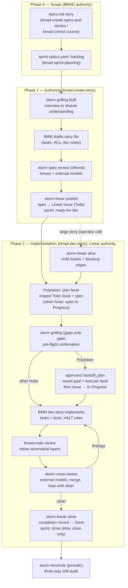

# The Dev Story Flow

How a story moves from scoped backlog entry to `Done` under BMAD + storm, and where each retired mattpocock skill's job now lives. This is the operator's map; the enforcing contracts live in the skills and overrides themselves.

## The flow at a glance

## Phase 0 — Scope (unchanged from before)

Epic and story scope is created and rescoped **only** through BMAD planning: `bmad-create-epics-and-stories` for decomposition, `bmad-correct-course` for every mid-sprint change including new bugs, `bmad-sprint-planning` for `sprint-status.yaml`. Unsolicited work (a found bug, ticket-shaped ideas) enters via `storm-linear intake` — a project-less `needs-triage` issue — and becomes real work only when correct-course gives it a story. Correct-course's `on_complete` now mirrors every scope change to Linear automatically (`storm-linear mirror`), which used to be hand-reconciled.

**Authority: `sprint-status.yaml` and `epics.md`.** The Linear issue, if it exists yet, is not authoritative.

## Phase 1 — Authoring: `bmad-create-story [story]`

One workflow now does what `/create-story` → grilling → `/to-spec` → publication did across three skills and a custom bridge:

1. **Activation** (storm overrides): the tracker contract loads as persistent facts; the workflow resolves the target story from `sprint-status.yaml`/`epics.md` and loads project context.
2. **Grilling** (`activation_steps_append`): `storm-grilling` in `full` mode — scope restated in glossary vocabulary, one-question-at-a-time interview, glossary/ADR capture inline. No drafting until the operator confirms shared understanding; a too-big/too-foggy story gets kicked back toward correct-course.
3. **Drafting** (BMM native): the story file with tasks/subtasks, ACs, and dev notes — this artifact is richer than the old flow's spec-only output; it's what dev-story executes against.
4. **`on_complete`** (storm): offer `storm-spec-review` (lens panel + external-model reviewers on a self-contained packet; accepted findings folded in *before* publication) → `storm-linear publish` (spec to the story's Linear issue, story-key anchor, `Todo`, `ready-for-agent`) → sprint entry to `ready-for-dev`.

**The publish is still the single handoff point.** Before it, the YAML wins; after it, Linear wins.

### Phase 1.5 — Slicing (optional, operator-invoked)

For a story too big for one implementation session: `storm-linear slice <story-key>` creates child tickets under the story issue in dependency order with native blocking relations. **This is a deliberate manual step** — unlike the rest of the old `/to-tickets` behavior it is not hooked into any workflow; the operator calls it after publication when grilling revealed the story's true size. Implementors then work the frontier (tickets with no open blockers), per the contract.

## Phase 2 — Implementation: `bmad-dev-story`

1. **Plan (Polytoken only)** (`activation_steps_append`): start `bmad-dev-story` in Polytoken's shipped `plan` facet (or switch there before opening the issue). Resolve and inspect the Todo story issue or child ticket, its published spec, story file, and project context without changing execution state. Other hosts retain the prior behavior and invoke `storm-linear open` at entry.
2. **Pre-flight grill** (`activation_steps_append`, gated by `grill_on_implement`): in the default `gaps-only` mode, probe only what the published spec leaves ambiguous, then one confirmation. `full` re-interviews; `off` trusts the spec. This step had no equivalent in the old flow — `/implement` trusted the spec cold.
3. **Goal-backed handoff (Polytoken only)**: after grilling, finish and review the implementation plan, then submit it with Polytoken's native `handoff_plan`. Approval activates the saved-session goal and transitions into `execute`; direct `propose_goal` or a direct switch from the shipped `plan` facet is neither needed nor supported. On execution entry, verify the active goal with `read_goal`, then invoke `storm-linear open` before changing implementation files. If plan integration did not activate a goal, halt with the issue still Todo. A rejected/canceled handoff likewise leaves the issue Todo. The execute session that opens an issue owns closing it out; child-ticket sessions never touch the parent story issue.
4. **Implement** (BMM native + storm-tdd): dev-story executes the story file's tasks/subtasks under its own HALT rules and the project's verification regime (zero-warning build, targeted then full gdUnit4 suites, visual procedure for UI work). A storm persistent fact binds implementation to `storm-tdd`: test-first at the seams recorded in the story's *Seams & test points* section, red before green, one vertical slice at a time, and no test at a seam the operator hasn't confirmed.
5. **Review**: `bmad-code-review` runs its native context-free adversarial layers (Blind Hunter, Edge Case Hunter, Verification Gap, Acceptance Auditor); its `on_complete` then runs `storm-cross-review` — external model families over the same diff+spec packet, findings merged into one triage, deduped, multi-model agreement ranked up. Every actionable finding is fixed or explicitly rebutted; fixes trigger a **complete fresh pass**, up to `review_loop_max_rounds`, then halt-and-report if not converged.
6. **Close** (`on_complete`): only after a clean exit — `storm-linear close` comments the completion record (what shipped, verification actually run, declined findings with reasons, deferred follow-ups) *before* moving the issue to `Done`, then reconciles `sprint-status.yaml` to `done` **only for a story close** (a child-ticket close reconciles nothing; the last child's session reports the story as ready to close rather than closing the parent). A non-clean exit leaves the issue `In Progress`, stated explicitly.

## Ongoing hygiene

`storm-reconcile` replaces reconciliation-by-discipline: run it after bulk changes, after BMAD updates, or on suspicion; it audits scope↔sprint↔Linear with the phase-decides rule and proposes fixes, applying only what the operator approves. `storm-setup check` audits the *wiring itself* after every upstream update. `storm-harness-improvement` remains the path for promoting trajectory friction into durable fixes. BMAD retrospectives close each epic as before.

## Old → new mapping

| Old (mattpocock era) | New home | Notes |
|---|---|---|
| `/create-story` (custom bridge) | `bmad-create-story` + storm overrides | Story resolution and context-loading were duplicating what BMM does natively; the bridge dissolves into the grilling hook |
| `grilling` + `domain-modeling` | `storm-grilling` | Vendored port; same interview rules, project glossary/ADR paths wired in; new `gaps-only` mode for implementation entry |
| `/to-spec` | `bmad-create-story` `on_complete` → `storm-linear publish` | Synthesis happens in the story draft; publication (issue update, story-key anchor, labels, `ready-for-dev` flip) is the hook, verbatim from the old contract |
| `review-spec` | `storm-spec-review` | Upgraded: BMAD lenses + cross-model external reviewers, pre-publication gate |
| `/to-tickets` | `storm-linear slice` | Same child-ticket + blocking-edge mechanics; **now operator-invoked after publish**, not a workflow step |
| `/implement` (plan + open ticket) | `bmad-dev-story` activation → Polytoken `plan` + grill + approved goal-backed handoff → `storm-linear open` in `execute` | Polytoken delays opening until planning is approved; other hosts open at entry. Open/close remain one contract owned by the execute session |
| `/implement` (build loop) | `bmad-dev-story` (BMM native) | Tasks/subtasks executed with tests under the project verification regime |
| `/tdd` | `storm-tdd` + dev-story persistent_fact | Vendored port; seams agreed during grilling land in the story's *Seams & test points* dev-notes section, and dev-story is bound to test-first at exactly those seams |
| `/code-review` + review-until-clean loop | `bmad-code-review` + `storm-cross-review` | Native adversarial layers plus genuinely cross-model panel; same loop discipline, now with a configured round cap |
| `/implement` (close-out) | `bmad-dev-story` `on_complete` → `storm-linear close` | Completion record, Done, story-only sprint reconcile — the old contract's exact rules |
| `/triage` (intake) | `storm-linear intake` + correct-course | Project-less `needs-triage` issue; triage-labels doc still applies |
| `/wayfinder` | **no storm equivalent yet** | Map-issue + child-ticket research planning; port as `storm-wayfinder` if the need recurs |
| `harness-improvement` | `storm-harness-improvement` | Moved into the module; targets updated for the override/module split |

## Watch-list for the first end-to-end story

The remaining deliberate thinning — no `/wayfinder` — plus the manual slicing step and the new seam-list round-trip (grilling → story dev notes → storm-tdd) are the places the new flow most plausibly squeaks. Run one backlog story (1-12, 1-13, or 1-15) through the whole pipe and route any friction through `storm-harness-improvement` before retiring the old skills from `.claude/skills/`.
